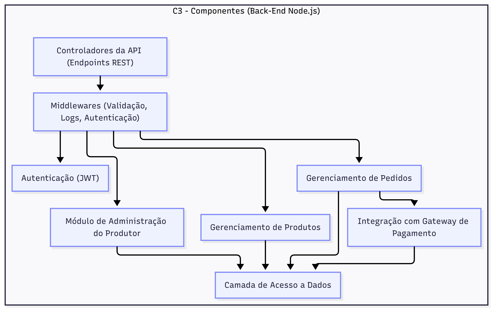

# DIAGRAMA C4 — NÍVEL COMPONENT (C3)
## Imagem

---
config:
  layout: elk
---
graph TB
    subgraph "C3 - Componentes (Back-End Node.js)"
        APIController["Controladores da API (Endpoints REST)"]
        Middleware["Middlewares (Validação, Logs, Autenticação)"]
        AuthModule["Autenticação (JWT)"]
        ProductModule["Gerenciamento de Produtos"]
        OrderModule["Gerenciamento de Pedidos"]
        PaymentModule["Integração com Gateway de Pagamento"]
        AdminModule["Módulo de Administração do Produtor"]
        DBAccess["Camada de Acesso a Dados"]
    end

    APIController --> Middleware
    Middleware --> AuthModule
    Middleware --> ProductModule
    Middleware --> OrderModule
    Middleware --> AdminModule
    OrderModule --> PaymentModule
    ProductModule --> DBAccess
    OrderModule --> DBAccess
    PaymentModule --> DBAccess
    AdminModule --> DBAccess

    classDef be fill:#eef2ff,stroke:#818cf8
    class APIController,Middleware,AuthModule,ProductModule,OrderModule,PaymentModule,AdminModule,DBAccess be
