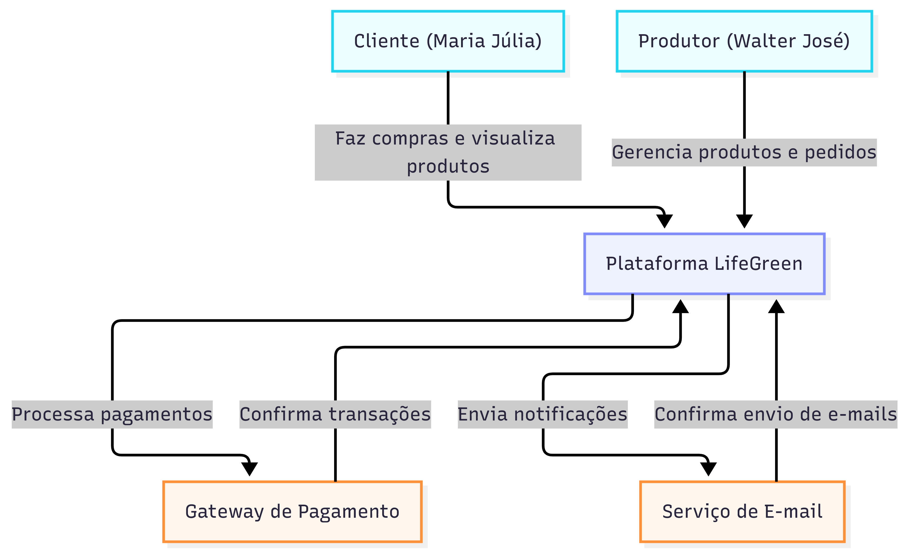

# Diagrama 1 - DIAGRAMA C4 — NÍVEL CONTEXT (C1)

## Imagem

## Código
---
config:
  layout: elk
---
graph TB
    Client["Cliente (Maria Júlia)"]
    Producer["Produtor (Walter José)"]
    LifeGreenSystem["Plataforma LifeGreen"]
    PaymentGateway["Gateway de Pagamento"]
    EmailService["Serviço de E-mail"]

    Client -->|Faz compras e visualiza produtos| LifeGreenSystem
    Producer -->|Gerencia produtos e pedidos| LifeGreenSystem
    LifeGreenSystem -->|Processa pagamentos| PaymentGateway
    LifeGreenSystem -->|Envia notificações| EmailService
    PaymentGateway -->|Confirma transações| LifeGreenSystem
    EmailService -->|Confirma envio de e-mails| LifeGreenSystem

    classDef client fill:#ecfeff,stroke:#22d3ee
    classDef system fill:#eef2ff,stroke:#818cf8
    classDef external fill:#fff7ed,stroke:#fb923c

    class Client,Producer client
    class LifeGreenSystem system
    class PaymentGateway,EmailService external
