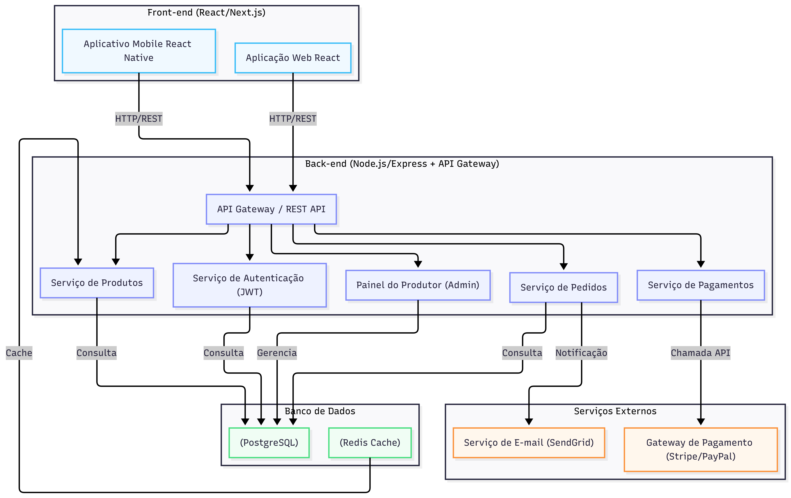

# Diagrama 1 - Diagrama de Containers
## Imagem

---
config:
  layout: elk
---
graph TB
    subgraph FrontEnd["Front-end (React/Next.js)"]
        WebApp["Aplicação Web React"]
        MobileApp["Aplicativo Mobile React Native"]
    end

    subgraph BackEnd["Back-end (Node.js/Express + API Gateway)"]
        APIService["API Gateway / REST API"]
        AuthService["Serviço de Autenticação (JWT)"]
        OrderService["Serviço de Pedidos"]
        ProductService["Serviço de Produtos"]
        PaymentService["Serviço de Pagamentos"]
        AdminService["Painel do Produtor (Admin)"]
    end

    subgraph Database["Banco de Dados"]
        PostgreSQL["(PostgreSQL)"]
        Redis["(Redis Cache)"]
    end

    subgraph External["Serviços Externos"]
        PaymentGateway["Gateway de Pagamento (Stripe/PayPal)"]
        EmailService["Serviço de E-mail (SendGrid)"]
    end

    WebApp -->|HTTP/REST| APIService
    MobileApp -->|HTTP/REST| APIService
    APIService --> AuthService
    APIService --> OrderService
    APIService --> ProductService
    APIService --> PaymentService
    APIService --> AdminService
    PaymentService -->|Chamada API| PaymentGateway
    OrderService -->|Notificação| EmailService
    AuthService -->|Consulta| PostgreSQL
    OrderService -->|Consulta| PostgreSQL
    ProductService -->|Consulta| PostgreSQL
    AdminService -->|Gerencia| PostgreSQL
    Redis -->|Cache| ProductService

    classDef fe fill:#f0f9ff,stroke:#38bdf8
    classDef be fill:#eef2ff,stroke:#818cf8
    classDef db fill:#f0fdf4,stroke:#4ade80
    classDef ext fill:#fff7ed,stroke:#fb923c

    class WebApp,MobileApp fe
    class APIService,AuthService,OrderService,ProductService,PaymentService,AdminService be
    class PostgreSQL,Redis db
    class PaymentGateway,EmailService ext
