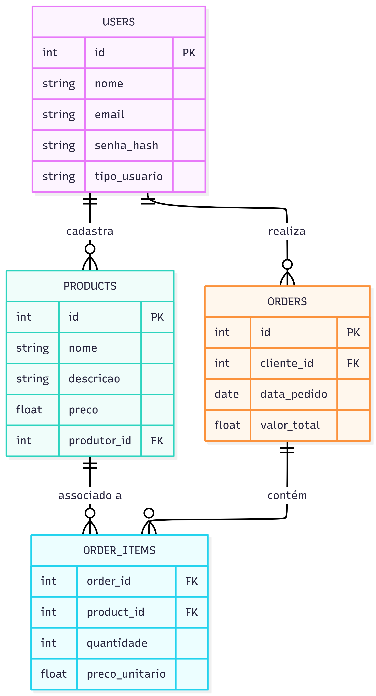

# Diagrama 5 - DIAGRAMS AS CODE
## Imagem

---
config:
  layout: elk
---
erDiagram
    USERS {
        int id PK
        string nome
        string email
        string senha_hash
        string tipo_usuario
    }
    PRODUCTS {
        int id PK
        string nome
        string descricao
        float preco
        int produtor_id FK
    }
    ORDERS {
        int id PK
        int cliente_id FK
        date data_pedido
        float valor_total
    }
    ORDER_ITEMS {
        int order_id FK
        int product_id FK
        int quantidade
        float preco_unitario
    }
    USERS ||--o{ PRODUCTS : "cadastra"
    USERS ||--o{ ORDERS : "realiza"
    ORDERS ||--o{ ORDER_ITEMS : "contém"
    PRODUCTS ||--o{ ORDER_ITEMS : "associado a"
